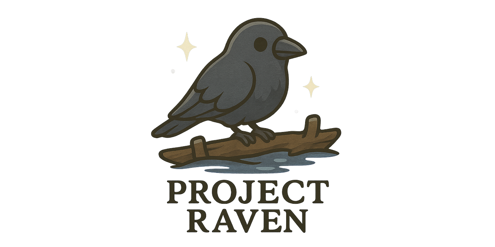

<div align="center">
  
  
  <h1>Project Raven</h1>
  
  <strong>Automated Raspberry Pi OS builds with Kodi & Tailscale</strong>
  
  <br><br>
  
  <a href="https://github.com/SysGrimm/Project-Raven/actions">
    
  </a>
</div>

## What is Project Raven?

Project Raven automatically builds custom Raspberry Pi OS images that include:

- **Kodi Media Center** - Auto-starting entertainment system
- **Tailscale VPN** - Secure remote access out of the box
- **Headless Ready** - Perfect for media centers and home servers
- **Zero Configuration** - Flash and boot, that's it!

## Quick Start

### 1. Download
Get the latest release from [Releases](../../releases/latest)

### 2. Flash
Use [Raspberry Pi Imager](https://www.raspberrypi.org/software/) or [balenaEtcher](https://www.balena.io/etcher/) to flash the `.img.xz` file to an SD card (8GB minimum)

### 3. Boot
Insert the SD card into your Raspberry Pi and power it on. Kodi will start automatically after the initial setup (2-3 minutes).

### 4. Configure Tailscale
```bash
# SSH into your Pi (default user: kodi)
ssh kodi@your-pi-ip

# Set up Tailscale
sudo tailscale up

# Follow the authentication URL provided
```

## Features

### Kodi Media Center
- **Auto-starts on boot** - No manual intervention needed
- **Hardware acceleration** - Optimized for Raspberry Pi performance
- **Audio/video drivers** - Pre-configured for best compatibility
- **Web interface** - Access at `http://your-pi-ip:8080`

### Tailscale VPN
- **Pre-installed** - Ready to configure with one command
- **Secure remote access** - Access your media center from anywhere
- **Zero-config networking** - No port forwarding or firewall setup needed
- **Cross-platform** - Works with all your devices

### System Optimization
- **SSH enabled** - Remote access ready out of the box
- **Headless operation** - No monitor required after setup
- **Auto-login** - Seamless user experience
- **Service management** - Systemd integration for reliability

## Supported Hardware

| Device | Status | Notes |
|--------|--------|-------|
| Raspberry Pi 5 | Full support | Best performance |
| Raspberry Pi 4 | Full support | All variants (2GB/4GB/8GB) |
| Raspberry Pi Zero 2 W | Limited support | Slower performance, WiFi only |
| Raspberry Pi 3 | Not supported | ARM64 architecture required |

### Storage Requirements
- **Minimum:** 8GB Class 10 SD card
- **Recommended:** 32GB+ high-endurance SD card
- **Best:** SSD via USB for better performance and reliability

## Network Access

### Local Network
- **SSH:** `ssh kodi@your-pi-ip`
- **Kodi Web:** `http://your-pi-ip:8080`
- **Kodi JSON-RPC:** `http://your-pi-ip:8080/jsonrpc`

### Tailscale Network (after setup)
- **SSH:** `ssh kodi@your-tailscale-ip`
- **Kodi Web:** `http://your-tailscale-ip:8080`
- **Secure streaming** - Direct access from any Tailscale device

## Build Automation

Project Raven includes sophisticated automation:

### Scheduled Builds
- **Weekly checks** - Every Monday at 6 AM UTC
- **New release detection** - Automatically detects Pi OS updates
- **Version tagging** - Clean versioning based on Pi OS release dates
- **Artifact management** - Automatic release creation with checksums

### Manual Builds
Trigger builds manually via GitHub Actions:

1. Go to [Actions](../../actions) tab
2. Select "Build Raspberry Pi OS with Tailscale & Kodi"
3. Click "Run workflow"
4. Optionally specify version or force rebuild

### Local Testing
Test builds on your own machine:

```bash
# Clone the repository
git clone https://github.com/SysGrimm/Project-Raven.git
cd Project-Raven

# Run local build test (requires Docker on macOS, native tools on Linux)
./scripts/local-build-test.sh

# Check for latest Pi OS version
./scripts/check-version.sh
```

## Setup Guide

### First Boot Process
1. **Initial boot** (30-60 seconds) - System initialization
2. **Package installation** (2-3 minutes) - Kodi and Tailscale setup
3. **Service configuration** (30 seconds) - Auto-login and service enablement
4. **Automatic reboot** - System restarts to activate all services
5. **Kodi starts** - Media center launches automatically

### User Accounts
- **Default user:** `kodi`
- **Password:** None (passwordless sudo enabled)
- **Groups:** `audio`, `video`, `input`, `dialout`, `plugdev`, `tty`, `users`

### Helper Scripts
Located in `/home/kodi/`:
- `setup-tailscale.sh` - Tailscale configuration guide
- `network-info.sh` - Display network and access information

## Troubleshooting

### Common Issues

#### Kodi Won't Start
```bash
# Check Kodi service status
sudo systemctl status kodi

# Restart Kodi service
sudo systemctl restart kodi

# View Kodi logs
sudo journalctl -u kodi -f
```

#### Tailscale Connection Problems
```bash
# Check Tailscale status
sudo tailscale status

# Reset Tailscale
sudo tailscale up --reset

# View Tailscale logs
sudo journalctl -u tailscaled -f
```

#### SSH Access Issues
```bash
# Enable SSH (if disabled)
sudo systemctl enable ssh
sudo systemctl start ssh

# Check SSH status
sudo systemctl status ssh
```

#### Performance Issues
```bash
# Check system resources
htop

# Check temperature
vcgencmd measure_temp

# Check for throttling
vcgencmd get_throttled
```

### Log Files
- **Kodi logs:** `/home/kodi/.kodi/temp/kodi.log`
- **System logs:** `sudo journalctl -f`
- **Kodi service:** `sudo journalctl -u kodi -f`
- **Tailscale:** `sudo journalctl -u tailscaled -f`

## Development

### Project Structure
```
Project-Raven/
├── .github/workflows/           # GitHub Actions automation
│   └── build-pios-tailscale.yml
├── scripts/                     # Build and utility scripts
│   ├── check-version.sh         # Pi OS version checker
│   ├── customize-image.sh       # Image customization
│   └── local-build-test.sh      # Local testing
├── build/                       # Local build output (gitignored)
└── README.md                    # This file
```

### Contributing

1. **Fork** this repository
2. **Create** a feature branch (`git checkout -b feature/amazing-feature`)
3. **Test** your changes with `./scripts/local-build-test.sh`
4. **Commit** your changes (`git commit -m 'Add amazing feature'`)
5. **Push** to the branch (`git push origin feature/amazing-feature`)
6. **Open** a Pull Request

### Testing Changes

#### Local Testing
```bash
# Test build process
./scripts/local-build-test.sh

# Test version checking
./scripts/check-version.sh --json

# Clean build
./scripts/local-build-test.sh --clean
```

#### GitHub Actions Testing
- Create a pull request to test the full automation
- Use workflow dispatch to test specific scenarios
- Check action logs for detailed build information

## Advanced Configuration

### Build Customization
Modify `scripts/customize-image.sh` to:
- Add additional software packages
- Change system configurations
- Customize Kodi settings
- Add startup scripts

### Workflow Customization
Edit `.github/workflows/build-pios-tailscale.yml` to:
- Change build schedule
- Modify build parameters
- Add additional testing
- Change release format

## Security Considerations

### Default Configuration
- **SSH enabled** with key-based authentication recommended
- **No default passwords** - passwordless sudo for kodi user
- **Tailscale integration** - Secure by default when configured
- **Automatic updates** - Pi OS security updates included

### Recommendations
1. **Change default user** - Consider creating a custom user account
2. **Configure SSH keys** - Disable password authentication
3. **Set up Tailscale** - Enable secure remote access
4. **Regular updates** - Keep system packages current

## License

This project is open source and includes:
- **Raspberry Pi OS** - [Raspberry Pi Foundation License](https://www.raspberrypi.org/about/)
- **Kodi** - [GPL v2](https://github.com/xbmc/xbmc/blob/master/LICENSE.md)
- **Tailscale** - [BSD 3-Clause](https://github.com/tailscale/tailscale/blob/main/LICENSE)

## Support

- **Documentation:** Check the [Wiki](../../wiki) (coming soon)
- **Bug Reports:** [Issues](../../issues)
- **Questions:** [Discussions](../../discussions)
- **Feature Requests:** [Issues](../../issues) with enhancement label

## Acknowledgments

- [Raspberry Pi Foundation](https://www.raspberrypi.org/) - Amazing ARM hardware
- [Kodi Team](https://kodi.tv/) - Excellent media center software
- [Tailscale](https://tailscale.com/) - Revolutionary mesh VPN
- [GitHub Actions](https://github.com/features/actions) - Powerful CI/CD platform

---

**Built with care for the Raspberry Pi community**

*Ready to flash and boot!*
